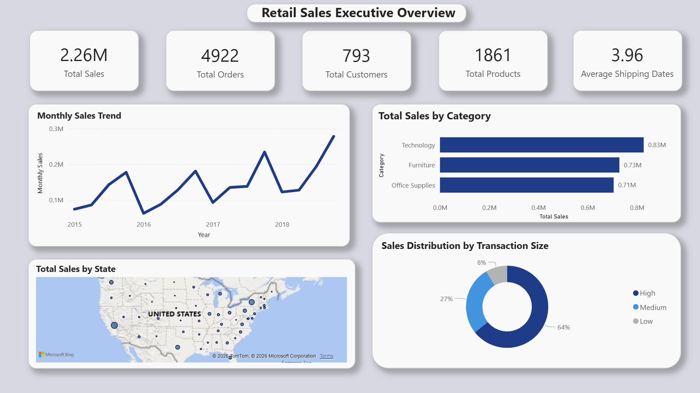
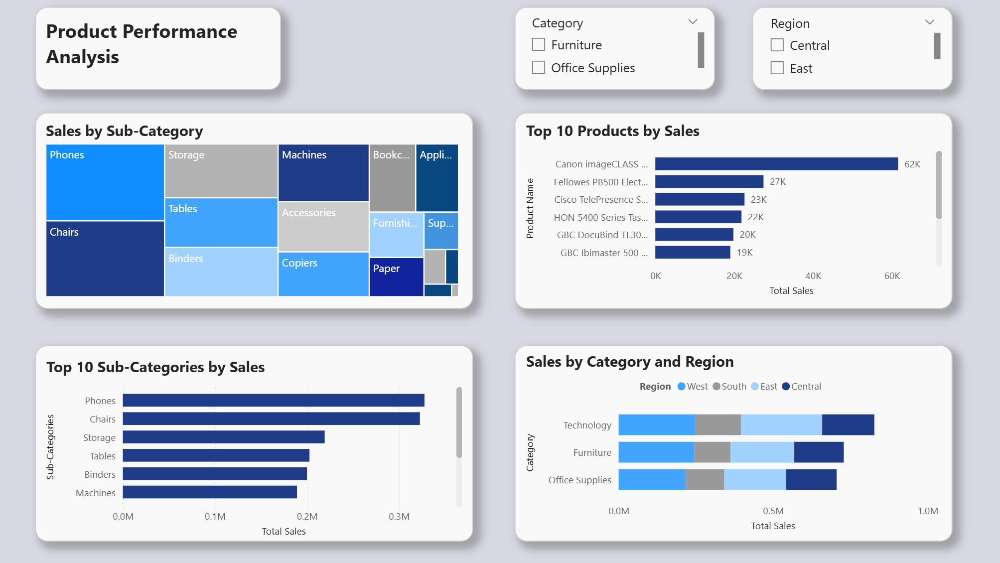
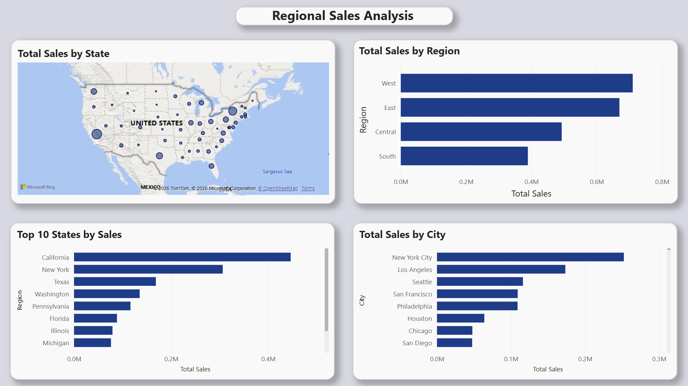
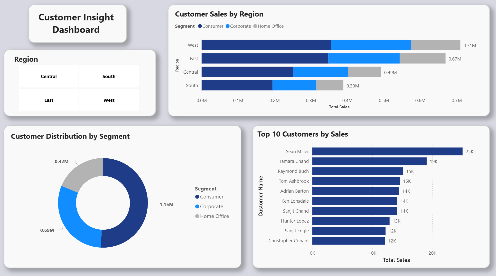

# end-to-end-retail-etl-pipeline

## Project Overview
This project demonstrates an end-to-end retail ETL pipeline built with Python, PostgreSQL, SQL, and Power BI. The goal of the project is to simulate how a retail company could centralize raw sales data, transform it into a structured warehouse model, and create business-ready dashboards for decision making.

The project includes:
- Data cleaning and transformation with Python
- PostgreSQL staging and warehouse tables
- Star schema design with fact and dimension tables
- SQL analysis queries
- Interactive Power BI dashboards
- Executive, product, regional, and customer insights

## Business Problem
A retail company has sales data stored in flat CSV files, making it difficult to analyze customer behavior, product performance, and regional sales trends.

The company needs a centralized reporting solution that can:
- Track total sales performance
- Analyse products and categories
- Understand customer behavior
- Compare sales across regions
- Support executive decision making

## Dataset
The project uses a retail sales dataset from Kaggle based on a Global Superstore-style business scenario.

Raw dataset source: [Superstore Sales Dataset](https://www.kaggle.com/datasets/rohitsahoo/sales-forecasting?utm_source=chatgpt.com)

## Tech Stack
- Python
- Pandas
- PostgreSQL
- SQL
- Power BI
- pgAdmin
- Google Colab

## ETL Process
### Extract 
- Imported raw CSV data into Python using Pandas
- Inspected rows, columns, missing values, and duplicates

### Transform
- Standardized column names to snake_case
- Converted date fields into datetime format
- Created new reporting fields

### Load
- Loaded cleaned data into PostgreSQL
- Created a staging table
- Built fact and dimension tables
- Populated the warehouse using SQL joins

## Dashboard Pages
### Executive Overview

### Product Performance

### Regional Analysis

### Customer Analysis

## Project Architecture
train.csv -> Python + Pandas Cleaning -> cleaned_superstore.csv -> stg_superstore_raw -> dim_customers dim_products dim_locations dim_dates fact_sales -> Power BI Dashboard

## Key Insights
- Technology generated the highest total sales among all product categories, outperforming Furniture and Office Supplies.
- The West and East regions produced the strongest sales performance, while the South region had the lowest overall sales.
- Average shipping time was approximately 4 days, with most orders shipped within 0 to 7 days.
- Sales activity increased over time, with visible growth trends across the later years in the dataset.
- The Consumer segment represented the largest share of sales compared to Corporate and Home Office customers.

## Business Recommendations
- Increase investment in the Technology category since it consistently generates the highest sales.
- Focus marketing campaigns on the West and East regions, where sales performance is strongest.
- Prioritize high-performing products and sub-categories such as Phones, Chairs, and Storage to maximize revenue growth.
- Develop targeted campaigns for the Consumer segment since it represents the largest share of sales.
- Consider expanding inventory in top-performing states and cities where demand is highest.

## Author
Juan DeVolder

Aspiring Data Analyst and Data Engineer

